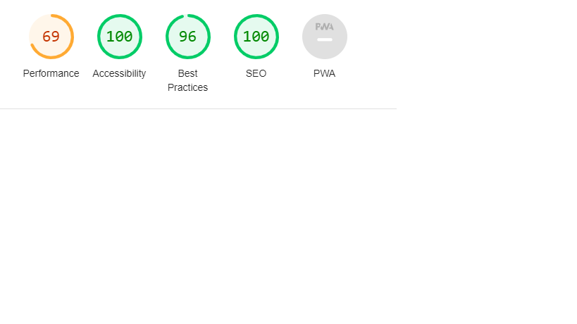

# Find Yourself 

# Introduction
# Find Yorself
### The Find Yourself project is created for people who want to change their lives by changing their thinking, but don't know how to start. There are some valuable tips that you can use and get started!
### My Project exists because I know that many people have problems with positive thinking and lack of motivation for their dreams. I am trying to share my knowledge that can help many people.
### The Find Youself website is intended for everyone of all ages who wants to learn the secrets of self-motivation and relax.

# Features
**Navbar**
- Featured at the top of the page, The navigation shows page name and logo in the left corner that links to the top of the page.
- The other navigation links, menu shows on the right: Home, About Us, Sign Up and Contact which link to the different sections of the page.
- Navigation is in a most suitable font and deep pink color which do beautiful contrast with black background, that makes the web comfy look and easy to read.
- The navigation clearly tells the user name of the website and makes all the information sections easy to find, it also allows to navigate seamlessly between pages on all devices without needing to use 'back' button.

**Header**
- The header shows photo showing a women practicing yoga and wonderful quote by Sherman Finesilver which is great website header.
- The quote motivates us to act and makes interested in continuing to read the rest of page.

Header Screenshot

**About Us section**
- The About Us section presents the mission, description and message of creating the website.
- About Us section shows clearly important information about provides an address, phone number and email address

**Sign Up section**
- Sign Up section has a form to collect information from users so they can sign up to the Find Yorself web.
- The form collects users First name, Surename and Email address.
- The Sign Up form is valuable to the users by gives ability to sign up to join Find Yourself community.

**Contact section**
- Contact section includes a form to collect answers, First name and Surename, users can ask about everything what they what to know.
- The Contact section is made with designed for easy acces and simple information.
- The Contact section is valuable to the users as it gives them the ability to find and contact company if they need to.

**Footer**
- The Footer section includes links to the relevant social media sites, like Facebook, Instagram, Youtube and Twitter for Find Yourself website.
- Footer links will open in a new tab to allow easy navigation for the user.
- The Footer is also valuable to the user as it encourages them to keep connected via social media.

**Validator Testing**
- HTML
### No errors were returned when passing through offical W3C validator
- CSS
### No errors were found when passing throught offical (Jigsaw) validator
- Accessibility
### I confirmed that the colors and fonts chosen are easy to read and accesible by running it throught lighthouse in devtools

**Deployment**
- The site was deployed to GitHub pages. The steps to deploy are as follows:
### In the Github repository, navigate to the Settings tab
### From the source section drop-down menu, select the Master Branch
### Once the master branch has been selected, the page provided the link to the completed web

**Credits**
# Content
- Most of die content was taken from the Cl Love Running Project and W3schools.com
# Media
- All of images was taken from Pexels

